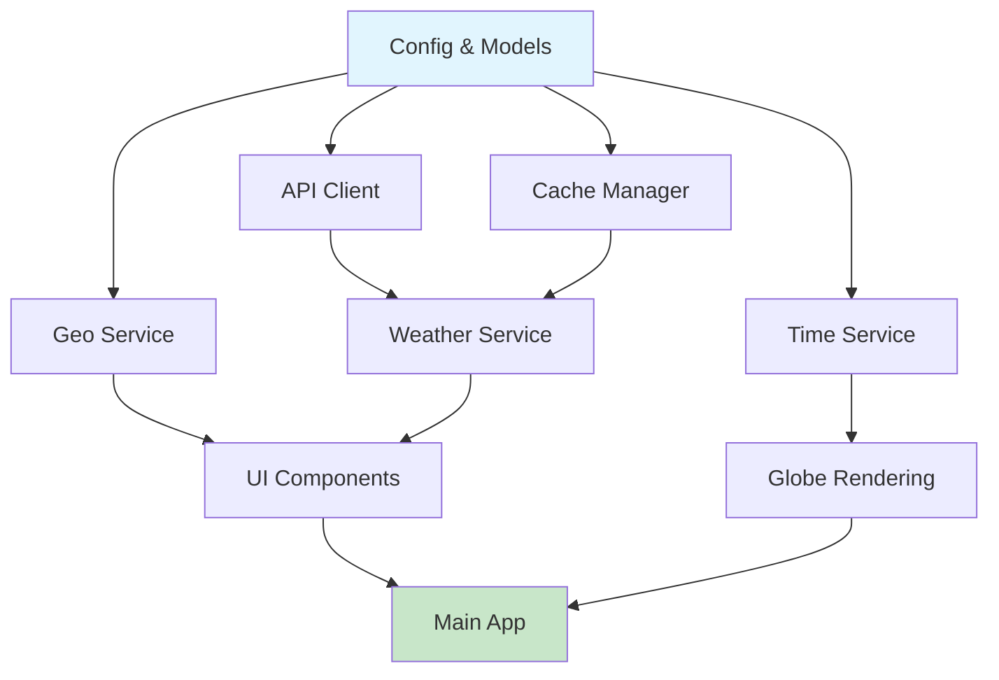

# Sky Globe - 世界の今の空 実装計画書

## 1. 実装概要

### 1.1 開発方針
- **段階的開発**: MVP → 機能拡張 → 最適化の順序で実装
- **モジュール分離**: 3層アーキテクチャに基づく独立性確保
- **テスト駆動**: 各モジュール実装時に単体テスト同時作成
- **継続的統合**: 機能実装毎の動作確認と結合テスト

### 1.2 開発スケジュール（8週間）

| フェーズ | 期間 | 主要成果物 | 担当工数 |
|----------|------|-----------|----------|
| Phase 1: 基盤構築 | Week 1-2 | 環境・基本構造 | 40時間 |
| Phase 2: コア機能 | Week 3-5 | 3D地球儀・API連携 | 80時間 |
| Phase 3: UI/UX | Week 6-7 | 検索・表示機能 | 60時間 |
| Phase 4: 統合・テスト | Week 8 | MVP完成版 | 30時間 |

## 2. 実装タスク詳細

### Phase 1: 基盤構築 (Week 1-2)

#### Week 1: 開発環境構築

**Task 1.1: プロジェクト初期化** [8h]
```bash
# プロジェクト構造作成
mkdir sky_globe
cd sky_globe
mkdir -p {src/{ui,business,data,utils},data,assets/weather_icons,tests,.streamlit}
touch app.py requirements.txt README.md

# Git初期化
git init
git add .
git commit -m "Initial project structure"
```

**Task 1.2: 依存関係設定** [4h]
```python
# requirements.txt作成
streamlit==1.28.0
pydeck==0.8.0
requests==2.31.0
pandas==2.0.0
numpy==1.24.0
pytz==2023.3
geopy==2.3.0
pytest==7.4.0
python-dotenv==1.0.0

# 仮想環境設定
python -m venv venv
source venv/bin/activate  # Windows: venv\Scripts\activate
pip install -r requirements.txt
```

**Task 1.3: 設定ファイル作成** [4h]
- `.streamlit/secrets.toml` の設定
- `src/utils/config.py` の実装
- 環境変数管理の実装

**Task 1.4: データモデル定義** [4h]
- `src/data/data_models.py` の実装
- WeatherData, CityInfo データクラス作成
- 型ヒント完備

#### Week 2: 基本モジュール実装

**Task 2.1: 都市データベース準備** [8h]
- 主要500都市のCSVデータ作成
- データ検証・クリーニング
- `data/cities.csv` 完成

**Task 2.2: API通信基盤** [8h]
- `src/data/api_client.py` 実装
- OpenWeatherMap API連携
- エラーハンドリング実装
- レート制限対応

**Task 2.3: キャッシュ管理システム** [8h]
- `src/data/cache_manager.py` 実装
- メモリキャッシュ機能
- TTL管理機能
- Streamlitキャッシュ連携

### Phase 2: コア機能実装 (Week 3-5)

#### Week 3: 地理情報サービス

**Task 3.1: 地理情報処理** [12h]
- `src/business/geo_service.py` 実装
- 都市検索機能（日英対応）
- ランダム都市選択機能
- 座標・距離計算機能

**Task 3.2: 時間計算サービス** [8h]
- `src/business/time_service.py` 実装
- 太陽位置計算
- 昼夜境界線算出
- タイムゾーン処理

**Task 3.3: 昼夜境界線可視化** [8h]
- 境界線座標計算アルゴリズム
- Pydeck レイヤー生成
- リアルタイム更新機能

#### Week 4: 天気情報サービス

**Task 4.1: 天気サービス実装** [12h]
- `src/business/weather_service.py` 実装
- 天気データ取得・解析
- キャッシュ連携
- エラーハンドリング

**Task 4.2: 天気データ表示** [8h]
- 天気アイコン表示
- 詳細情報フォーマット
- 単位変換機能（°C/°F）

**Task 4.3: API統合テスト** [8h]
- 実API接続テスト
- エラーケーステスト
- パフォーマンステスト

#### Week 5: 3D地球儀実装

**Task 5.1: 基本地球儀表示** [12h]
- Pydeck 3D地球儀実装
- 地球テクスチャ設定
- 基本操作（回転・ズーム）対応

**Task 5.2: レイヤーシステム** [8h]
- 昼夜レイヤー
- 都市マーカーレイヤー
- 天気情報レイヤー
- レイヤー合成機能

**Task 5.3: インタラクティブ機能** [8h]
- 都市クリック検出
- ツールチップ表示
- 視点移動アニメーション

### Phase 3: UI/UX実装 (Week 6-7)

#### Week 6: ユーザーインターフェース

**Task 6.1: レイアウト実装** [10h]
- `src/ui/layouts.py` 実装
- サイドバー・メインコンテンツ構成
- レスポンシブデザイン

**Task 6.2: コンポーネント作成** [10h]
- `src/ui/components.py` 実装
- 検索ボックスコンポーネント
- 天気情報カードコンポーネント
- ボタン・設定コンポーネント

**Task 6.3: スタイル適用** [10h]
- `src/ui/styles.py` 実装
- カスタムCSS定義
- ダークテーマ適用
- アニメーション効果

#### Week 7: 機能統合・改善

**Task 7.1: 検索機能統合** [10h]
- オートコンプリート実装
- 検索結果表示
- 選択時の地球儀連動

**Task 7.2: ランダム機能実装** [8h]
- ランダムボタン機能
- 大陸別フィルター
- 選択都市のハイライト

**Task 7.3: 設定機能** [10h]
- 温度単位切替
- 言語切替（日英）
- 自動回転設定

**Task 7.4: エラーハンドリング強化** [8h]
- ユーザーフレンドリーなエラー表示
- ログ機能実装
- フォールバック機能

### Phase 4: 統合・テスト (Week 8)

#### Week 8: 最終統合・品質保証

**Task 8.1: 統合テスト** [8h]
- 全機能結合テスト
- エラーケーステスト
- パフォーマンステスト

**Task 8.2: UI/UXテスト** [8h]
- ユーザビリティテスト
- ブラウザ互換性テスト
- レスポンシブテスト

**Task 8.3: 最適化・チューニング** [8h]
- パフォーマンス最適化
- キャッシュ効率化
- レンダリング改善

**Task 8.4: デプロイ準備** [6h]
- Streamlit Cloud設定
- 本番環境テスト
- ドキュメント作成

## 3. モジュール実装順序

### 3.1 実装依存関係図



### 3.2 並行開発可能タスク

**Week 3-4並行作業**:
- 地理情報サービス ↔ 天気情報サービス
- 時間計算 ↔ API統合テスト

**Week 6-7並行作業**:
- UI コンポーネント ↔ スタイル定義
- 検索機能 ↔ 設定機能

## 4. 具体的実装コード例

### 4.1 メインアプリ構造

```python
# app.py
import streamlit as st
from src.business.weather_service import WeatherService
from src.business.geo_service import GeoService
from src.ui.layouts import render_main_layout
from src.ui.components import render_search_component, render_globe_component
from src.utils.config import Config

class SkyGlobeApp:
    def __init__(self):
        self.weather_service = WeatherService()
        self.geo_service = GeoService()
        self.config = Config()
        
    def run(self):
        """メインアプリケーション実行"""
        st.set_page_config(
            page_title="Sky Globe - 世界の今の空",
            page_icon="🌍",
            layout="wide",
            initial_sidebar_state="expanded"
        )
        
        # セッション状態初期化
        if 'selected_city' not in st.session_state:
            st.session_state.selected_city = self.geo_service.get_city_by_name("Tokyo")
        
        # メインレイアウト描画
        self._render_layout()
    
    def _render_layout(self):
        """レイアウト描画"""
        col1, col2 = st.columns([1, 2])
        
        with col1:
            self._render_sidebar()
        
        with col2:
            self._render_main_content()
    
    def _render_sidebar(self):
        """サイドバー描画"""
        st.header("🔍 都市検索")
        
        # 検索コンポーネント
        selected_city = render_search_component(self.geo_service)
        if selected_city:
            st.session_state.selected_city = selected_city
        
        # 天気情報表示
        if st.session_state.selected_city:
            weather_data = self.weather_service.get_current_weather(
                st.session_state.selected_city.name_en
            )
            if weather_data:
                self._render_weather_info(weather_data)
    
    def _render_main_content(self):
        """メインコンテンツ描画"""
        st.header("🌍 世界の今の空")
        
        # 3D地球儀表示
        if st.session_state.selected_city:
            render_globe_component(
                st.session_state.selected_city,
                self.weather_service
            )
    
    def _render_weather_info(self, weather_data):
        """天気情報カード表示"""
        st.markdown("### 📊 天気情報")
        
        col1, col2 = st.columns(2)
        with col1:
            st.metric("気温", f"{weather_data.temperature}°C")
            st.metric("湿度", f"{weather_data.humidity}%")
        
        with col2:
            st.metric("体感温度", f"{weather_data.feels_like}°C")
            st.metric("風速", f"{weather_data.wind_speed}m/s")

if __name__ == "__main__":
    app = SkyGlobeApp()
    app.run()
```

### 4.2 データモデル定義

```python
# src/data/data_models.py
from dataclasses import dataclass
from datetime import datetime
from typing import Tuple, Optional

@dataclass
class CityInfo:
    id: int
    name_en: str
    name_ja: str
    country_code: str
    country_en: str
    country_ja: str
    latitude: float
    longitude: float
    timezone: str
    continent: str
    population: int
    
    def to_dict(self) -> dict:
        """辞書形式に変換"""
        return {
            'id': self.id,
            'name': self.name_ja,
            'coordinates': [self.longitude, self.latitude],
            'country': self.country_ja
        }

@dataclass
class WeatherData:
    city_id: int
    city_name: str
    country_code: str
    coordinates: Tuple[float, float]
    temperature: float
    feels_like: float
    humidity: int
    pressure: int
    wind_speed: float
    wind_direction: int
    visibility: int
    weather_main: str
    weather_description: str
    weather_icon: str
    timezone_offset: int
    local_time: datetime
    sunrise: datetime
    sunset: datetime
    updated_at: datetime
    
    def to_display_dict(self, temp_unit: str = "C") -> dict:
        """表示用辞書に変換"""
        temp = self.temperature
        feels = self.feels_like
        
        if temp_unit == "F":
            temp = temp * 9/5 + 32
            feels = feels * 9/5 + 32
        
        return {
            'temperature': round(temp, 1),
            'feels_like': round(feels, 1),
            'humidity': self.humidity,
            'pressure': self.pressure,
            'wind_speed': round(self.wind_speed, 1),
            'weather': self.weather_description,
            'icon': self.weather_icon
        }
```

### 4.3 API クライアント実装

```python
# src/data/api_client.py
import requests
import time
from typing import Dict, Optional
import streamlit as st
from src.utils.config import Config

class APIClient:
    def __init__(self):
        self.api_key = self._get_api_key()
        self.base_url = "https://api.openweathermap.org/data/2.5"
        self.session = requests.Session()
        self.request_count = 0
        self.last_reset = time.time()
    
    def _get_api_key(self) -> str:
        """APIキー取得"""
        try:
            return st.secrets["api_keys"]["openweathermap"]
        except KeyError:
            st.error("🔐 OpenWeatherMap APIキーが設定されていません")
            st.stop()
    
    def call_weather_api(self, params: Dict) -> Optional[Dict]:
        """天気API呼び出し"""
        if not self._check_rate_limit():
            return None
        
        params.update({
            'appid': self.api_key,
            'units': 'metric',
            'lang': 'ja'
        })
        
        try:
            response = self.session.get(
                f"{self.base_url}/weather",
                params=params,
                timeout=10
            )
            response.raise_for_status()
            return response.json()
            
        except requests.exceptions.Timeout:
            st.error("⏱️ APIの応答時間が長すぎます")
            return None
        except requests.exceptions.ConnectionError:
            st.error("🌐 ネットワーク接続に問題があります")
            return None
        except requests.exceptions.HTTPError as e:
            if e.response.status_code == 404:
                st.error("❌ 都市が見つかりません")
            else:
                st.error(f"❌ API呼び出しエラー: {e.response.status_code}")
            return None
    
    def _check_rate_limit(self) -> bool:
        """レート制限チェック"""
        current_time = time.time()
        
        # 1時間ごとにリセット
        if current_time - self.last_reset > 3600:
            self.request_count = 0
            self.last_reset = current_time
        
        if self.request_count >= 900:
            st.error("⏰ 1時間あたりのAPI呼び出し制限に達しました")
            return False
        
        self.request_count += 1
        return True
```

## 5. テスト実装計画

### 5.1 単体テスト構成

```python
# tests/test_weather_service.py
import pytest
from unittest.mock import Mock, patch
from src.business.weather_service import WeatherService
from src.data.data_models import WeatherData

class TestWeatherService:
    @pytest.fixture
    def weather_service(self):
        return WeatherService()
    
    @pytest.fixture
    def mock_api_response(self):
        return {
            'coord': {'lon': 139.69, 'lat': 35.69},
            'weather': [{'main': 'Clear', 'description': 'clear sky', 'icon': '01d'}],
            'main': {'temp': 25.5, 'feels_like': 27.2, 'humidity': 60, 'pressure': 1013},
            'wind': {'speed': 3.2, 'deg': 180},
            'visibility': 10000,
            'sys': {'country': 'JP', 'sunrise': 1679184000, 'sunset': 1679227200},
            'timezone': 32400,
            'name': 'Tokyo'
        }
    
    def test_get_current_weather_success(self, weather_service, mock_api_response):
        """天気データ取得成功テスト"""
        with patch.object(weather_service.api_client, 'call_weather_api', 
                         return_value=mock_api_response):
            result = weather_service.get_current_weather('Tokyo')
            
            assert result is not None
            assert result.temperature == 25.5
            assert result.weather_main == 'Clear'
            assert result.city_name == 'Tokyo'
    
    def test_get_current_weather_api_error(self, weather_service):
        """APIエラーテスト"""
        with patch.object(weather_service.api_client, 'call_weather_api',
                         return_value=None):
            result = weather_service.get_current_weather('InvalidCity')
            assert result is None
```

### 5.2 統合テスト実装

```python
# tests/test_integration.py
import pytest
import streamlit as st
from app import SkyGlobeApp

class TestIntegration:
    def test_app_initialization(self):
        """アプリ初期化テスト"""
        app = SkyGlobeApp()
        assert app.weather_service is not None
        assert app.geo_service is not None
    
    def test_city_search_flow(self):
        """都市検索フローテスト"""
        app = SkyGlobeApp()
        
        # 都市検索
        cities = app.geo_service.search_cities("Tokyo")
        assert len(cities) > 0
        
        # 天気データ取得
        weather = app.weather_service.get_current_weather("Tokyo")
        if weather:  # API制限考慮
            assert weather.city_name == "Tokyo"
```

## 6. デプロイメント手順

### 6.1 Streamlit Cloud デプロイ

1. **GitHub リポジトリ準備**
```bash
git add .
git commit -m "MVP version complete"
git push origin main
```

2. **Streamlit Cloud設定**
- GitHub連携
- secrets.toml設定（APIキー）
- 自動デプロイ設定

3. **本番環境確認**
- 全機能動作確認
- パフォーマンステスト
- ユーザビリティテスト

## 7. リスク対策と対応

### 7.1 技術リスク対応

| リスク | 対策 | 代替案 |
|--------|------|--------|
| Pydeck パフォーマンス問題 | 事前プロトタイプ作成 | 2D マップフォールバック |
| API制限超過 | キャッシュ強化 | 有料プラン移行 |
| ブラウザ互換性 | 定期テスト実施 | ブラウザ別対応コード |

### 7.2 スケジュールリスク対応

- **バッファ時間**: 各フェーズに10%のバッファ組み込み
- **優先度管理**: 必須機能優先、推奨機能は次期版に延期可能
- **並行開発**: 独立性の高いタスクの並行実施

## 8. 成功基準とチェックポイント

### 8.1 各フェーズ完了基準

**Phase 1完了基準**:
- [ ] 全モジュール構造が作成されている
- [ ] 基本的なAPI通信ができる
- [ ] 都市データが正常に読み込める

**Phase 2完了基準**:
- [ ] 3D地球儀が表示される
- [ ] 天気データが取得・表示される
- [ ] 昼夜境界線が描画される

**Phase 3完了基準**:
- [ ] 都市検索が動作する
- [ ] ランダム選択が動作する
- [ ] UI が美しく表示される

**Phase 4完了基準**:
- [ ] 全機能が統合されて動作する
- [ ] エラーハンドリングが適切
- [ ] デプロイ可能な状態

### 8.2 品質チェックリスト

- [ ] 単体テストカバレッジ80%以上
- [ ] 全機能の手動テスト完了
- [ ] パフォーマンス要件達成
- [ ] セキュリティチェック完了
- [ ] ドキュメント整備完了

この実装計画に従って開発を進めることで、8週間でのMVP完成と、継続的な品質向上を実現できます。