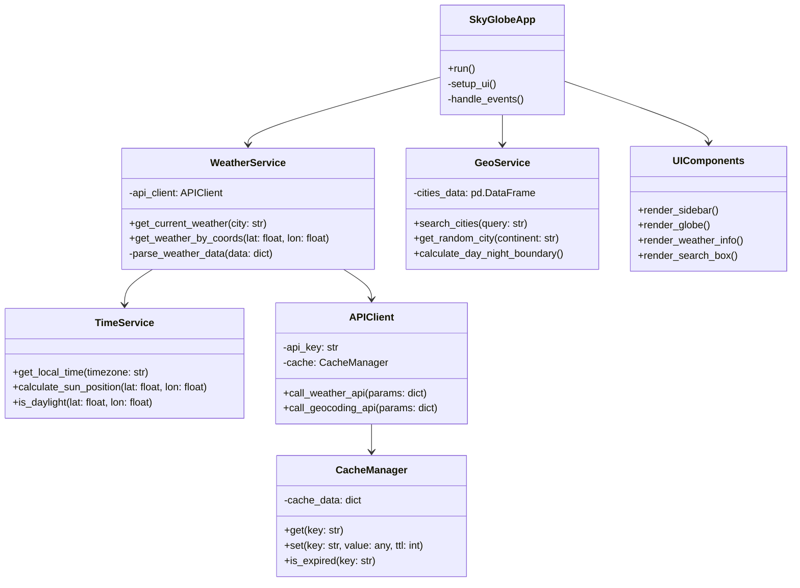
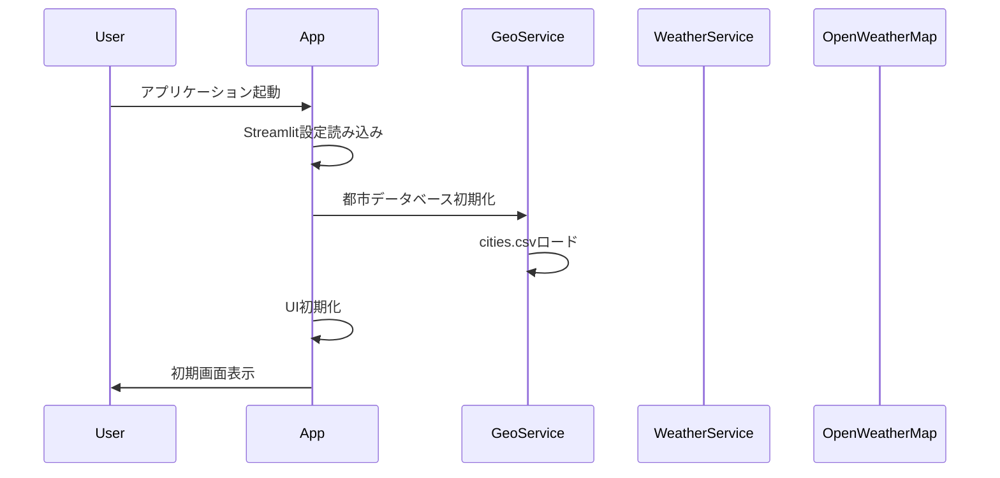
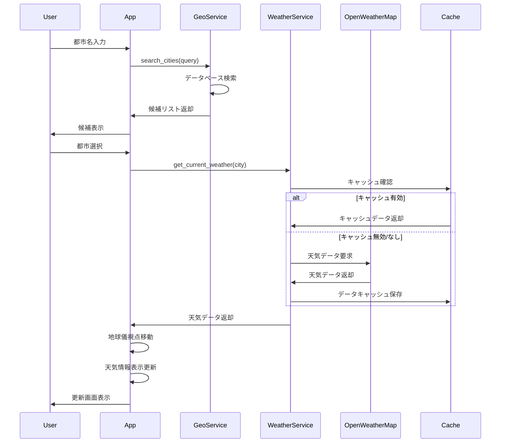
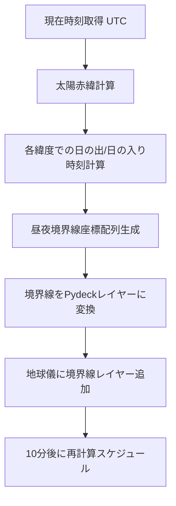

# Sky Globe - 世界の今の空 詳細設計書

## 1. システム概要

### 1.1 システム構成図

```
┌─────────────────────────────────────────────────────────┐
│                    Browser (Client)                    │
├─────────────────────────────────────────────────────────┤
│  ┌─────────────┐  ┌─────────────┐  ┌─────────────────┐  │
│  │  Streamlit  │  │   Pydeck    │  │   JavaScript    │  │
│  │   Frontend  │  │  3D Render  │  │   Controls      │  │
│  └─────────────┘  └─────────────┘  └─────────────────┘  │
├─────────────────────────────────────────────────────────┤
│                 Streamlit Application                   │
├─────────────────────────────────────────────────────────┤
│  ┌─────────────┐  ┌─────────────┐  ┌─────────────────┐  │
│  │   UI Layer  │  │Business Layer│  │   Data Layer    │  │
│  │             │  │              │  │                 │  │
│  │ - Controls  │  │ - Weather    │  │ - API Manager   │  │
│  │ - Display   │  │ - Geography  │  │ - Cache Manager │  │
│  │ - Layout    │  │ - Time Calc  │  │ - Data Parser   │  │
│  └─────────────┘  └─────────────┘  └─────────────────┘  │
├─────────────────────────────────────────────────────────┤
│                  External Services                      │
│  ┌─────────────────────────┐  ┌─────────────────────────┐│
│  │   OpenWeatherMap API    │  │    Static Data Files    ││
│  │                         │  │                         ││
│  │ - Current Weather       │  │ - Cities Database       ││
│  │ - Geocoding            │  │ - Countries Data        ││
│  └─────────────────────────┘  └─────────────────────────┘│
└─────────────────────────────────────────────────────────┘
```

### 1.2 技術スタック詳細

| レイヤー | 技術 | バージョン | 用途 |
|----------|------|------------|------|
| Frontend | Streamlit | 1.28.0+ | Webアプリケーションフレームワーク |
| 3D Visualization | Pydeck | 0.8.0+ | 3D地球儀描画 |
| HTTP Client | Requests | 2.31.0+ | API通信 |
| Data Processing | Pandas | 2.0.0+ | データ処理・変換 |
| Math Operations | NumPy | 1.24.0+ | 数値計算 |
| Timezone | Pytz | 2023.3+ | タイムゾーン処理 |
| Geography | Geopy | 2.3.0+ | 地理計算 |

## 2. アーキテクチャ設計

### 2.1 ディレクトリ構成

```
sky_globe/
├── app.py                      # メインアプリケーション
├── requirements.txt            # 依存関係
├── .streamlit/
│   └── secrets.toml           # API設定
├── src/
│   ├── __init__.py
│   ├── ui/
│   │   ├── __init__.py
│   │   ├── components.py      # UIコンポーネント
│   │   ├── layouts.py         # レイアウト管理
│   │   └── styles.py          # スタイル定義
│   ├── business/
│   │   ├── __init__.py
│   │   ├── weather_service.py # 天気情報処理
│   │   ├── geo_service.py     # 地理情報処理
│   │   └── time_service.py    # 時間計算
│   ├── data/
│   │   ├── __init__.py
│   │   ├── api_client.py      # API通信
│   │   ├── cache_manager.py   # キャッシュ管理
│   │   └── data_models.py     # データモデル
│   └── utils/
│       ├── __init__.py
│       ├── config.py          # 設定管理
│       └── validators.py      # バリデーション
├── data/
│   ├── cities.csv             # 都市データ
│   └── countries.csv          # 国データ
├── assets/
│   └── weather_icons/         # 天気アイコン
└── tests/
    ├── test_weather_service.py
    ├── test_geo_service.py
    └── test_api_client.py
```

### 2.2 クラス図



## 3. データベース設計

### 3.1 都市データ構造 (cities.csv)

| カラム名 | データ型 | 説明 | 例 |
|----------|----------|------|-----|
| id | int | 都市ID | 1 |
| name_en | str | 英語都市名 | Tokyo |
| name_ja | str | 日本語都市名 | 東京 |
| country_code | str | 国コード | JP |
| country_en | str | 英語国名 | Japan |
| country_ja | str | 日本語国名 | 日本 |
| latitude | float | 緯度 | 35.6895 |
| longitude | float | 経度 | 139.6917 |
| timezone | str | タイムゾーン | Asia/Tokyo |
| continent | str | 大陸 | Asia |
| population | int | 人口 | 13929280 |

### 3.2 天気データ構造 (メモリ保存)

```python
@dataclass
class WeatherData:
    city_id: int
    city_name: str
    country_code: str
    coordinates: Tuple[float, float]
    temperature: float
    feels_like: float
    humidity: int
    pressure: int
    wind_speed: float
    wind_direction: int
    visibility: int
    weather_main: str
    weather_description: str
    weather_icon: str
    timezone_offset: int
    local_time: datetime
    sunrise: datetime
    sunset: datetime
    updated_at: datetime
```

## 4. API設計

### 4.1 内部API (クラスメソッド)

#### WeatherService

```python
class WeatherService:
    def get_current_weather(self, city: str) -> WeatherData:
        """都市名から天気情報を取得"""
        
    def get_weather_by_coords(self, lat: float, lon: float) -> WeatherData:
        """座標から天気情報を取得"""
        
    def is_cache_valid(self, key: str) -> bool:
        """キャッシュ有効性確認"""
```

#### GeoService

```python
class GeoService:
    def search_cities(self, query: str, limit: int = 10) -> List[CityInfo]:
        """都市検索（日英対応）"""
        
    def get_random_city(self, continent: str = None) -> CityInfo:
        """ランダム都市選択"""
        
    def calculate_day_night_boundary(self, datetime_utc: datetime) -> List[Tuple[float, float]]:
        """昼夜境界線計算"""
        
    def get_city_by_id(self, city_id: int) -> CityInfo:
        """ID指定都市情報取得"""
```

### 4.2 外部API仕様

#### OpenWeatherMap Current Weather API

```python
# リクエスト例
GET https://api.openweathermap.org/data/2.5/weather
    ?q={city_name}
    &appid={API_key}
    &units=metric
    &lang=ja

# レスポンス構造
{
    "coord": {"lon": 139.69, "lat": 35.69},
    "weather": [{
        "id": 800,
        "main": "Clear",
        "description": "clear sky",
        "icon": "01d"
    }],
    "main": {
        "temp": 25.5,
        "feels_like": 27.2,
        "temp_min": 23.1,
        "temp_max": 28.3,
        "pressure": 1013,
        "humidity": 60
    },
    "wind": {"speed": 3.2, "deg": 180},
    "visibility": 10000,
    "sys": {
        "country": "JP",
        "sunrise": 1679184000,
        "sunset": 1679227200
    },
    "timezone": 32400,
    "name": "Tokyo"
}
```

## 5. UI/UX詳細設計

### 5.1 コンポーネント設計

#### 5.1.1 メインレイアウト

```python
def render_main_layout():
    st.set_page_config(
        page_title="Sky Globe - 世界の今の空",
        page_icon="🌍",
        layout="wide",
        initial_sidebar_state="expanded"
    )
    
    # カスタムCSS適用
    st.markdown(get_custom_css(), unsafe_allow_html=True)
    
    # ヘッダー
    render_header()
    
    # メインコンテンツ
    col1, col2 = st.columns([1, 2])
    with col1:
        render_sidebar()
    with col2:
        render_main_content()
```

#### 5.1.2 3D地球儀コンポーネント

```python
def render_globe(selected_city: CityInfo, weather_data: WeatherData):
    # 地球儀の基本設定
    view_state = pydeck.ViewState(
        longitude=selected_city.longitude,
        latitude=selected_city.latitude,
        zoom=1.5,
        pitch=0,
        bearing=0
    )
    
    # レイヤー構成
    layers = [
        create_earth_layer(),
        create_day_night_layer(),
        create_city_markers_layer(),
        create_weather_layer(weather_data)
    ]
    
    # Deckインスタンス作成
    deck = pydeck.Deck(
        layers=layers,
        initial_view_state=view_state,
        tooltip={'text': '{name}\n{temperature}°C\n{weather}'}
    )
    
    st.pydeck_chart(deck)
```

#### 5.1.3 検索コンポーネント

```python
def render_search_component():
    search_type = st.radio(
        "検索方法",
        ["都市名検索", "ランダム選択"],
        horizontal=True
    )
    
    if search_type == "都市名検索":
        query = st.text_input(
            "都市名を入力",
            placeholder="Tokyo, London, Paris..."
        )
        
        if query:
            suggestions = geo_service.search_cities(query)
            selected_city = st.selectbox(
                "候補から選択",
                suggestions,
                format_func=lambda x: f"{x.name_ja} ({x.country_ja})"
            )
            
    else:  # ランダム選択
        continent = st.selectbox(
            "大陸を選択（任意）",
            ["すべて", "アジア", "ヨーロッパ", "北アメリカ", "南アメリカ", "アフリカ", "オセアニア"]
        )
        
        if st.button("ランダム都市を選択", type="primary"):
            selected_city = geo_service.get_random_city(
                None if continent == "すべて" else continent
            )
            st.session_state.selected_city = selected_city
```

### 5.2 スタイル定義

#### 5.2.1 カスタムCSS

```css
/* メインテーマ */
.main-header {
    background: linear-gradient(135deg, #1E2A3A, #2C3E50);
    padding: 1rem;
    border-radius: 10px;
    margin-bottom: 2rem;
    text-align: center;
}

.main-header h1 {
    color: #FFFFFF;
    font-size: 2.5rem;
    font-weight: 300;
    margin: 0;
}

/* 天気情報カード */
.weather-card {
    background: rgba(255, 255, 255, 0.1);
    backdrop-filter: blur(10px);
    border-radius: 15px;
    padding: 1.5rem;
    border: 1px solid rgba(255, 255, 255, 0.2);
    margin-bottom: 1rem;
}

.weather-icon {
    width: 80px;
    height: 80px;
    margin: 0 auto;
    display: block;
}

.temperature {
    font-size: 3rem;
    font-weight: 300;
    text-align: center;
    color: #FFFFFF;
}

/* 検索ボックス */
.search-container {
    background: rgba(255, 255, 255, 0.05);
    padding: 1rem;
    border-radius: 10px;
    margin-bottom: 1rem;
}

/* ボタンスタイル */
.random-button {
    background: linear-gradient(45deg, #F5A623, #F39C12);
    border: none;
    color: white;
    padding: 0.75rem 1.5rem;
    border-radius: 25px;
    cursor: pointer;
    transition: all 0.3s ease;
}

.random-button:hover {
    transform: translateY(-2px);
    box-shadow: 0 5px 15px rgba(245, 166, 35, 0.4);
}
```

## 6. 詳細処理フロー

### 6.1 アプリケーション初期化フロー



### 6.2 都市検索・選択フロー



### 6.3 昼夜境界線計算フロー



## 7. エラーハンドリング設計

### 7.1 エラー分類と対応

| エラー分類 | 原因 | 対応方法 | ユーザー表示 |
|------------|------|----------|--------------|
| API_ERROR | OpenWeatherMap APIエラー | 再試行 → フォールバック → エラー表示 | "天気情報の取得に失敗しました" |
| NETWORK_ERROR | ネットワーク接続エラー | 再試行 → キャッシュデータ使用 | "ネットワーク接続を確認してください" |
| DATA_ERROR | データ形式エラー | ログ出力 → デフォルト値使用 | "データの読み込みに問題があります" |
| VALIDATION_ERROR | 入力値エラー | 入力値クリア → エラーメッセージ表示 | "入力内容を確認してください" |

### 7.2 エラーハンドリング実装

```python
class ErrorHandler:
    @staticmethod
    def handle_api_error(error: Exception, context: str) -> Optional[dict]:
        """API エラーハンドリング"""
        logger.error(f"API Error in {context}: {str(error)}")
        
        if isinstance(error, requests.exceptions.Timeout):
            st.error("⏱️ 応答時間が長すぎます。しばらく待ってから再試行してください。")
        elif isinstance(error, requests.exceptions.ConnectionError):
            st.error("🌐 ネットワーク接続に問題があります。")
        else:
            st.error("❌ 天気情報の取得に失敗しました。")
        
        return None
    
    @staticmethod
    def handle_validation_error(error: ValidationError) -> None:
        """バリデーションエラーハンドリング"""
        st.error(f"⚠️ 入力エラー: {error.message}")
    
    @staticmethod
    def handle_unexpected_error(error: Exception, context: str) -> None:
        """予期しないエラーハンドリング"""
        logger.exception(f"Unexpected error in {context}")
        st.error("😵 予期しないエラーが発生しました。ページを更新してください。")
```

## 8. パフォーマンス最適化設計

### 8.1 キャッシュ戦略

```python
class CacheManager:
    def __init__(self):
        self.cache = {}
        self.cache_ttl = {
            'weather': 600,  # 10分
            'geocoding': 3600,  # 1時間
            'cities': 86400,  # 24時間
        }
    
    @st.cache_data(ttl=600)  # Streamlitキャッシュ併用
    def get_weather_data(self, city_id: int) -> Optional[WeatherData]:
        """天気データキャッシュ取得"""
        key = f"weather_{city_id}"
        return self._get_from_cache(key)
    
    def _get_from_cache(self, key: str) -> Optional[any]:
        """キャッシュから取得"""
        if key in self.cache:
            data, timestamp = self.cache[key]
            cache_type = key.split('_')[0]
            
            if time.time() - timestamp < self.cache_ttl.get(cache_type, 300):
                return data
            else:
                del self.cache[key]
        
        return None
```

### 8.2 レンダリング最適化

```python
def optimize_rendering():
    """レンダリング最適化設定"""
    
    # Streamlit設定
    st.set_option('client.showErrorDetails', False)
    st.set_option('client.toolbarMode', 'minimal')
    
    # Pydeck設定
    pydeck.settings.use_binary_transport = True
    
    # データ圧縮
    @st.cache_data
    def compress_city_data(df: pd.DataFrame) -> pd.DataFrame:
        """都市データの最適化"""
        return df.round({'latitude': 4, 'longitude': 4})
```

## 9. セキュリティ設計

### 9.1 APIキー管理

```toml
# .streamlit/secrets.toml
[api_keys]
openweathermap = "your_api_key_here"

[settings]
debug_mode = false
max_requests_per_hour = 900
```

```python
class SecurityManager:
    @staticmethod
    def get_api_key() -> str:
        """安全なAPIキー取得"""
        try:
            return st.secrets["api_keys"]["openweathermap"]
        except KeyError:
            st.error("🔐 API設定に問題があります。")
            st.stop()
    
    @staticmethod
    def validate_input(user_input: str) -> str:
        """入力値サニタイゼーション"""
        # SQLインジェクション対策
        sanitized = re.sub(r'[^\w\s-]', '', user_input)
        # 長さ制限
        return sanitized[:100]
    
    @staticmethod
    def rate_limit_check() -> bool:
        """レート制限チェック"""
        if 'request_count' not in st.session_state:
            st.session_state.request_count = 0
            st.session_state.last_reset = time.time()
        
        # 1時間ごとにリセット
        if time.time() - st.session_state.last_reset > 3600:
            st.session_state.request_count = 0
            st.session_state.last_reset = time.time()
        
        if st.session_state.request_count >= 900:
            st.error("⏰ 1時間あたりのリクエスト制限に達しました。")
            return False
        
        st.session_state.request_count += 1
        return True
```

## 10. テスト設計

### 10.1 単体テスト

```python
import pytest
from unittest.mock import Mock, patch

class TestWeatherService:
    def test_get_current_weather_success(self):
        """天気データ取得成功テスト"""
        # Given
        weather_service = WeatherService()
        mock_response = {
            'main': {'temp': 25.5, 'humidity': 60},
            'weather': [{'main': 'Clear', 'description': 'clear sky'}]
        }
        
        # When
        with patch.object(weather_service.api_client, 'call_weather_api', 
                         return_value=mock_response):
            result = weather_service.get_current_weather('Tokyo')
        
        # Then
        assert result.temperature == 25.5
        assert result.weather_main == 'Clear'
    
    def test_get_current_weather_api_error(self):
        """API エラーハンドリングテスト"""
        # Given
        weather_service = WeatherService()
        
        # When
        with patch.object(weather_service.api_client, 'call_weather_api',
                         side_effect=requests.exceptions.Timeout()):
            result = weather_service.get_current_weather('InvalidCity')
        
        # Then
        assert result is None
```

### 10.2 結合テスト

```python
class TestIntegration:
    def test_full_weather_flow(self):
        """天気情報取得フル フロー テスト"""
        # 実際のAPIを使用した結合テスト
        # 環境変数でテスト用APIキーを設定
        pass
    
    def test_ui_interaction(self):
        """UI操作統合テスト"""
        # Streamlit テスト用ライブラリを使用
        pass
```

## 11. デプロイメント設計

### 11.1 Streamlit Cloud デプロイ

```python
# requirements.txt
streamlit==1.28.0
pydeck==0.8.0
requests==2.31.0
pandas==2.0.0
numpy==1.24.0
pytz==2023.3
geopy==2.3.0
```

### 11.2 環境設定

```python
# config.py
import os
from typing import Dict, Any

class Config:
    # 環境別設定
    ENVIRONMENTS = {
        'development': {
            'debug': True,
            'cache_ttl': 60,  # 1分
            'max_requests': 100
        },
        'production': {
            'debug': False,
            'cache_ttl': 600,  # 10分
            'max_requests': 900
        }
    }
    
    @classmethod
    def get_config(cls) -> Dict[str, Any]:
        env = os.getenv('ENVIRONMENT', 'development')
        return cls.ENVIRONMENTS.get(env, cls.ENVIRONMENTS['development'])
```

この詳細設計書により、開発チームは具体的な実装作業に着手できます。各コンポーネントの責務が明確に分離されており、テスト可能で保守しやすい設計となっています。